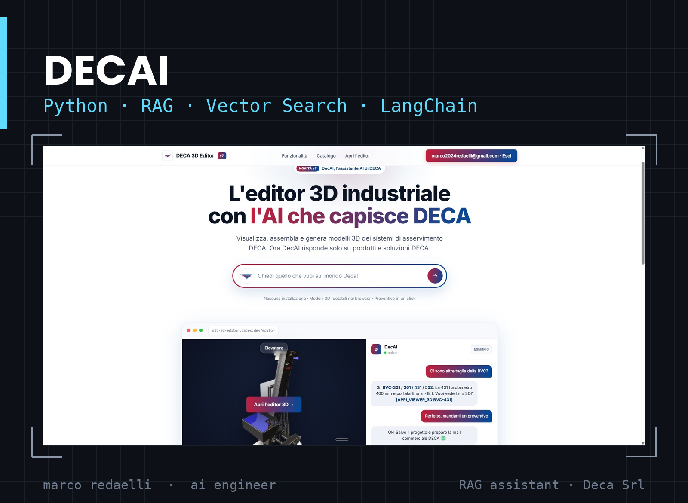
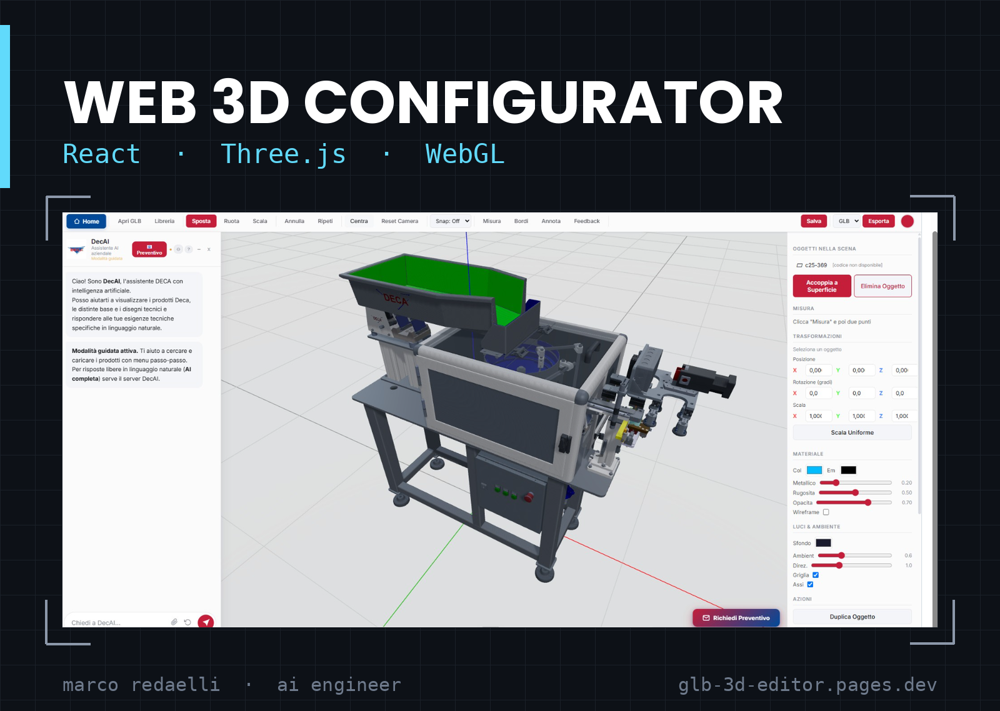
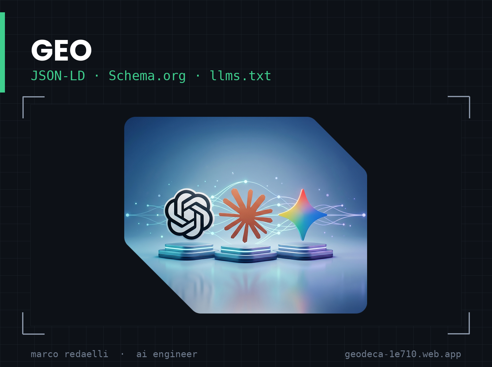
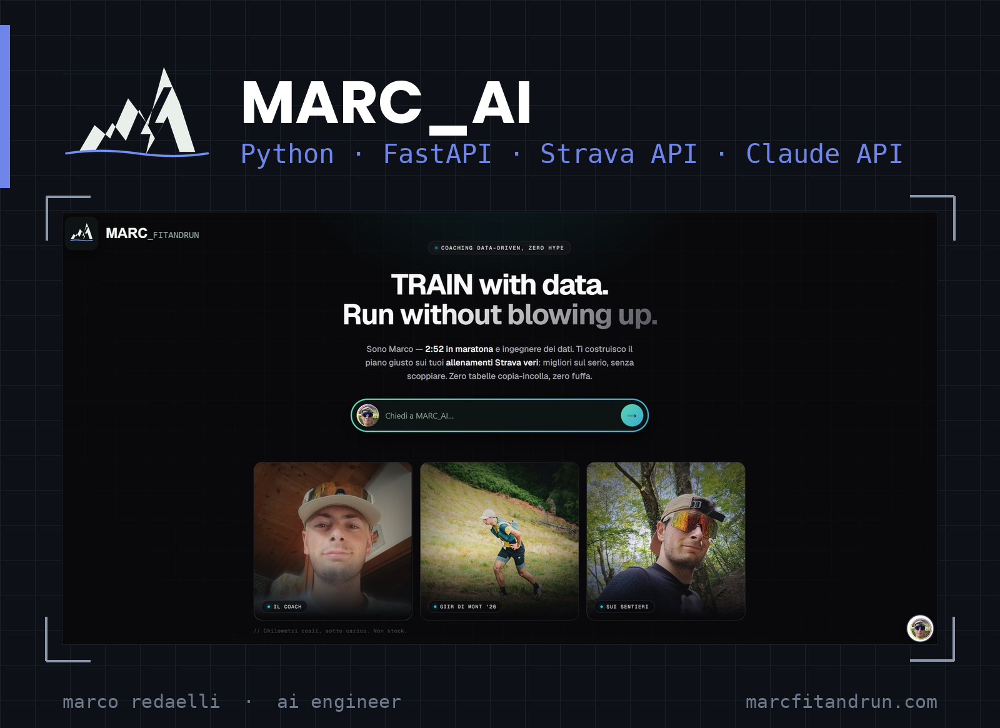

[English](README.md) · **Italiano**

# Marco Redaelli

### AI Engineer & Runner — Lecco, Italia

Costruisco prodotti AI, software e business digitali. 
Fondatore di **[iLeader](https://illeader.vercel.app/)** (consulenza AI per PMI italiane) e **[Marc_fitandrun](https://marcfitandrun.com)** (coaching per la corsa basato sui dati).

---

## Chi sono

Sono Marco Redaelli, AI Engineer, e vivo vicino al Lago di Como. Lavoro nel punto in cui i **large language model** incontrano i **problemi industriali reali**: aziende che producono oggetti fisici, con un ufficio tecnico che gira ancora su PDF e che non hanno mai messo un modello in produzione.

Nel concreto: pipeline RAG su documentazione interna disordinata, agenti collegati agli strumenti che l'azienda già usa, e training di modelli quando il task lo richiede davvero. In parallelo porto avanti due prodotti miei, e circa 80 km a settimana di corsa.

- Ingegneria della Produzione Industriale — Politecnico di Milano (polo di Lecco)
- Con base a Valgreghentino, provincia di Lecco — lavoro con PMI in tutta la Lombardia
- PB maratona: **2h50** — che è anche il motivo per cui esiste MARC_AI
- Interessi attuali: workflow agentici, MCP, embodied AI, visibilità sui motori generativi

---

## Progetti in evidenza

Tre sono nati in **Deca Srl**, azienda che produce sistemi di asservimento industriale: un assistente di retrieval, uno strumento di vendita 3D e un layer di visibilità sui motori generativi. Il quarto è un prodotto mio.

---

### 1 · DecAI — Assistente RAG per una PMI manifatturiera

Assistente conversazionale interno costruito su una pipeline di **retrieval-augmented generation** sul catalogo tecnico di prodotto — **senza fine-tuning**. Il valore sta nel layer di retrieval, non nei pesi del modello: ingestion e chunking di documentazione tecnica eterogenea, embedding e ricerca vettoriale, reranking, e generazione di risposte ancorate ai documenti sorgente con citazioni verificabili.

Supporta la forza vendita nella qualificazione tecnica e nella costruzione dell'offerta, rispondendo sulla base del catalogo reale e non della memoria del modello. L'assistente è vincolato ai prodotti dell'azienda: se la domanda esce dal catalogo si ferma, invece di improvvisare.

`Python` · `RAG` · `Vector Search` · `LangChain` · `LLM APIs`

---

### 2 · DECA 3D Editor — Configuratore di prodotto con assistente AI integrato

Editor GLB/GLTF in browser per sistemi di asservimento industriale, pensato per sostituire il catalogo PDF statico in un processo di vendita B2B. Gestione varianti, cambio materiali, rendering in tempo reale, viewer condivisibile e generazione 3D a partire da una foto o da una descrizione testuale.

Nella versione attuale configuratore e assistente RAG sono un prodotto solo: DecAI vive dentro l'editor, quindi il potenziale cliente può chiedere quale taglia serve per la sua applicazione, aprire il modello nel viewer 3D direttamente dalla risposta, e da lì arrivare alla richiesta di preventivo — senza uscire dalla pagina e senza aspettare un commerciale.

`React` · `Three.js` · `WebGL` · `Cloudflare Pages` — [demo live](https://glb-3d-editor.pages.dev/) · [repository](https://github.com/MarcoRedaelli-AI/3D-Editor-Deca-S.r.l.)

---

### 3 · GEO — Rendere un'azienda manifatturiera leggibile dalle AI

I motori generativi citano ciò che riescono a interpretare. Gli impianti consegnati da questa azienda vivevano in due posti che non si parlavano: un foglio di schede realizzazione e un archivio di rete con i modelli 3D, organizzato per componente e non per commessa. Niente collegava una scheda ai suoi file di progetto, e niente sulle pagine pubbliche diceva a un modello che cosa fossero.

Ho inventariato l'archivio componente per componente e agganciato ogni scheda ai suoi file reali, poi ho costruito un catalogo prototipo navigabile — un centinaio di pagine su 35 famiglie di prodotto, raggruppate per acronimo, così che sito, foglio e archivio raccontassero finalmente la stessa gerarchia.

Poi la scoperta che contava. Quarantadue file di dati strutturati erano stati scritti ed erano validi — e nessuno di essi era su una pagina. Nel sorgente pubblicato non esisteva alcun blocco `application/ld+json`. Contenuto corretto, che viveva dentro un foglio Excel: per i crawler, inesistente.

Ho quindi generato la cosa vera: un unico grafo collegato di **65 nodi** con l'anagrafica aziendale, la pagina raccolta, 19 elenchi per famiglia e 42 schede prodotto. Dodici proprietà inventate — fuori dal vocabolario schema.org, quindi ignorate in silenzio dai validatori — sono diventate **334 `PropertyValue`** dentro `additionalProperty`: stesso contenuto, contenitore corretto. Le proprietà standard che i modelli leggono davvero (`url`, `sku`, `brand`, `manufacturer`, `isSimilarTo`) sono state popolate da dati già presenti nel foglio. Verificato prima della consegna: 65 identificativi univoci, 294 riferimenti interni risolti, zero termini fuori vocabolario.

Il punto non sono le keyword. È che il lavoro reale, specifico e verificabile di un fornitore diventa materiale recuperabile su cui un modello può ancorare una risposta.

`JSON-LD` · `Schema.org` · `llms.txt` · `Static Site Generation` · `Firebase Hosting`

---

### 4 · MARC_AI — Training Intelligence

Il motore dietro il mio brand di coaching. Legge la telemetria Strava e un profilo atleta a 18 variabili, poi genera e adatta i piani di allenamento. Attorno gira uno stack di marketing che si automatizza da sé: una pipeline che trasforma le attività Strava in Instagram Stories, una newsletter settimanale e un funnel di onboarding che rientra direttamente nel modello.

`Python` · `FastAPI` · `Strava API` · `PIL` · `Claude API` — [marcfitandrun.com](https://marcfitandrun.com)

---

### Altri progetti

- [**Unitree G1 — RL su umanoide**](https://github.com/MarcoRedaelli-AI/Unitree-G1-Robot) — integrazione SDK, simulazione e ambienti di reinforcement learning per l'umanoide Unitree G1. Training di policy di locomozione in Isaac Lab e MuJoCo. `Python` `Isaac Lab` `MuJoCo` `RL`
- [**Visualizzatore STEP**](https://github.com/MarcoRedaelli-AI/Visualizzatore-STEP) — parser e viewer Python per file CAD STEP: estrazione geometrie, lettura metadati, conversione in mesh. Base per pipeline automatiche da CAD a web. `Python` `OpenCascade` `CAD`
- [**Openclaw**](https://github.com/MarcoRedaelli-AI/Openclaw) — guida HTML interattiva per installare e configurare OpenClaw su Raspberry Pi 4.
- [**Claude Project**](https://github.com/MarcoRedaelli-AI/Claude-Project) — esperimenti costruiti con le API Anthropic e MCP.

---

## Cosa so costruire

**Sistemi RAG** — l'intera pipeline: ingestion di documentazione reale e disordinata, strategie di chunking che tengono su contenuti tecnici, embedding e ricerca vettoriale, reranking, e generazione di risposte ancorate alle fonti recuperate anziché alla memoria del modello.

**Training di modelli** — fine-tuning di LLM open-weight (LoRA / QLoRA) quando il task lo richiede davvero, e reinforcement learning per il controllo robotico in Isaac Lab e MuJoCo. Ho imparato a essere onesto su quando serve addestrare e quando invece bastano retrieval o un prompting migliore.

**3D sul web** — configuratori di prodotto interattivi e viewer GLB/CAD in React e Three.js, comprese le pipeline che portano la geometria dal CAD al browser.

**Visibilità sui motori generativi (GEO)** — dati strutturati, `llms.txt` e architettura dei contenuti perché il lavoro reale di un'azienda diventi recuperabile e citabile dalle AI, invece che invisibile.

**Automazioni agentiche con Claude** — oltre un anno di lavoro quotidiano con Claude, da Claude 3 Opus fino a Opus 5: API, Claude Code e connettori MCP per collegare agenti ai sistemi che l'azienda già usa. La maggior parte di ciò che rilascio nasce così.

---

## Cosa faccio

**AI Engineering @ Deca Srl** — *2025 → 2026* 
Ho realizzato i tre progetti qui sopra: DecAI, il configuratore 3D e l'implementazione GEO — un assistente di retrieval per la forza vendita, uno strumento di vendita in browser che sostituisce il catalogo PDF, e un layer di contenuti strutturati che rende lo storico produttivo dell'azienda citabile dai motori di ricerca generativi.

**iLeader** — *Founder* 
Consulenza AI e sviluppo su misura per PMI italiane: assistenti conversazionali, RAG sulla documentazione interna e automazioni agentiche costruite su Claude con connettori MCP verso i sistemi che il cliente già usa — CRM, mail, gestionale, storage documentale. In aggiunta, lavoro di visibilità sui motori generativi.

**Marc_fitandrun** — *Founder & Running Coach* 
Coaching data-driven per corsa su strada e trail. Audit telemetrici della performance, programmi di coaching continuativo e lo stack di marketing automatizzato descritto sopra.

---

## Stack

---

### Parliamone

Disponibile per ruoli di AI engineering e progetti di consulenza — integrazione LLM, sistemi RAG, visibilità sui motori generativi, automazioni agentiche per PMI.

**marco2024redaelli@gmail.com**

Marco Redaelli · Lecco, Italia · <i>Looking for the English version? <a href="README.md">Here</a>.</i>

