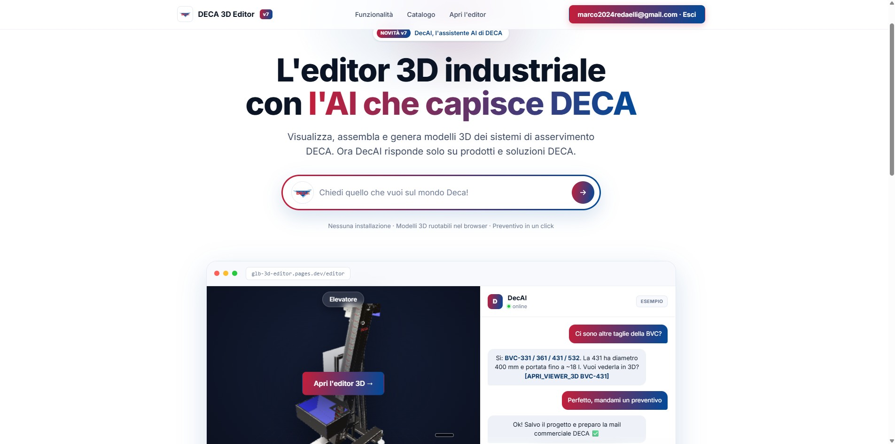
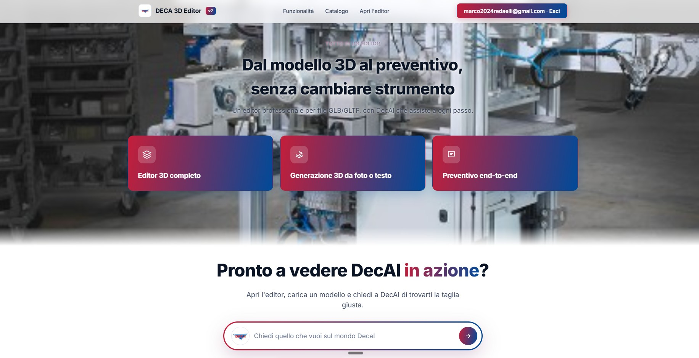
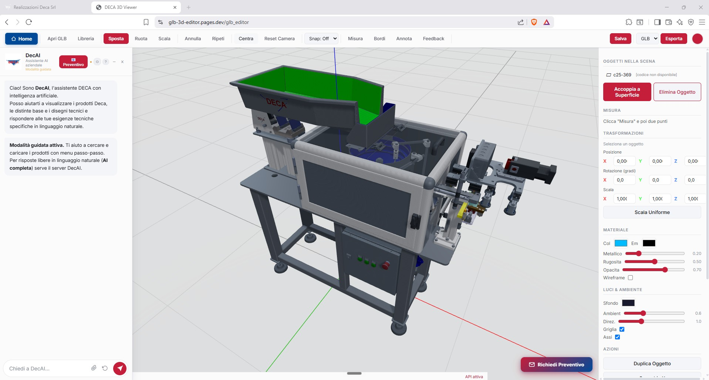

**English** · [Italiano](README.it.md)

# Marco Redaelli

### AI Engineer & Runner

Building AI products, software and digital businesses. 
Founder of **[iLeader](https://illeader.vercel.app/)** (AI consulting for Italian SMEs) and **[Marc_fitandrun](https://marcfitandrun.com)** (data-driven running coaching).

---

## About

I'm an AI Engineer based near Lake Como, Italy. I work at the intersection of **large language models** and **real industrial problems** — the kind of company that makes physical products, has a paper-based technical office, and has never deployed a model in its life.

My day-to-day is building RAG pipelines over messy internal documentation, wiring agents into the tools a business already uses, and training models when the task actually calls for it. On the side I run two products of my own, and about 80 km a week on the road.

- Industrial Production Engineering — Politecnico di Milano (Lecco)
- Marathon PB: **2h50** — which is also the reason MARC_AI exists
- Currently interested in: agentic workflows, MCP, embodied AI, generative search visibility

---

## Featured Projects

### DecAI — RAG Assistant for a Manufacturing SME

An internal conversational assistant built on a **retrieval-augmented generation** pipeline over a technical product catalogue — no fine-tuning involved. The value is in the retrieval layer, not in the weights: document ingestion and chunking of heterogeneous technical material, embedding and vector search, reranking, and grounded answer generation with citations back to the source documents.

It supports the sales team during technical qualification and quoting, answering product questions from the actual catalogue instead of from a model's memory.

<table>
  <tr>
    <td width="50%"></td>
    <td width="50%"></td>
  </tr>
</table>

`Python` · `RAG` · `Vector Search` · `LangChain` · `LLM APIs`

---

### Other work

<table>
  <tr>
    <td width="50%" valign="top">
      
      <h3>Web 3D Product Configurator</h3>
      
Browser-based GLB editor for interactive product customisation. Variant handling, material swapping and real-time rendering, built to replace static PDF catalogues in a B2B sales process.

      
<code>React</code> <code>Three.js</code> <code>WebGL</code> <code>Cloudflare Pages</code>

    </td>
    <td width="50%" valign="top">
      
      <h3>Unitree G1 — Humanoid RL</h3>
      
SDK integration, simulation and reinforcement learning environments for the Unitree G1 humanoid. Locomotion policy training in Isaac Lab and MuJoCo, plus configuration and deployment scripts.

      
<code>Python</code> <code>Isaac Lab</code> <code>MuJoCo</code> <code>RL</code>

    </td>
  </tr>
  <tr>
    <td width="50%" valign="top">
      
      <h3>MARC_AI — Training Intelligence</h3>
      
The engine behind my coaching brand. Ingests Strava telemetry and an 18-variable athlete profile, then generates and adapts training plans. Includes an automated Strava → Instagram Stories content pipeline.

      
<code>Python</code> <code>FastAPI</code> <code>Strava API</code> <code>PIL</code> <code>Claude API</code>

    </td>
    <td width="50%" valign="top">
      
      <h3>STEP File Viewer</h3>
      
Python parser and viewer for STEP CAD files — geometry extraction, metadata reading and mesh conversion. Groundwork for automated CAD-to-web pipelines.

      
<code>Python</code> <code>OpenCascade</code> <code>CAD</code>

    </td>
  </tr>
</table>

**Also here:** [Openclaw](https://github.com/marco2024redaelli-hash/Openclaw) — interactive HTML guide for installing and configuring OpenClaw on a Raspberry Pi 4 · [Claude Project](https://github.com/marco2024redaelli-hash/Claude-Project) — experiments built with the Anthropic API and MCP.

---

## What I Can Build

**RAG systems** — the full pipeline: ingesting messy real-world documentation, chunking strategies that survive technical content, embeddings and vector search, reranking, and answer generation grounded in retrieved sources rather than model memory.

**Model training** — fine-tuning open-weight LLMs (LoRA / QLoRA) when a task genuinely needs it, and reinforcement learning for robotic control in Isaac Lab and MuJoCo. I've learned to be honest about when training is the answer and when retrieval or better prompting is.

**3D on the web** — interactive product configurators and GLB/CAD viewers in React and Three.js, plus the pipelines that get geometry from CAD to browser.

**Agentic automation with Claude** — over a year of daily work with Claude, from Claude 3 Opus through Opus 5: the API, Claude Code, and MCP connectors wiring agents into the systems a business already runs. Most of what I ship is built this way.

## What I Do

**AI Engineering @ Deca Srl** — *2025 → 2026* 
Built **DecAI**, an internal conversational assistant powered by a RAG pipeline over the product catalogue — retrieval, reranking and grounded generation with source citations — supporting the sales team in technical qualification and quoting. Also delivered the 3D web configurator above, and a full **GEO** implementation (`llms.txt`, JSON-LD structured data, content rewriting) so the company's catalogue is correctly parsed and cited by generative search engines.

**iLeader** — *Founder* 
AI consulting and custom development for Italian SMEs: conversational assistants, RAG over internal documentation, and agentic automations built on Claude with MCP connectors into the systems a client already runs — CRM, mail, ERP, document storage. Plus generative search visibility work.

**Marc_fitandrun** — *Founder & Running Coach* 
Data-driven coaching for road and trail running. Telemetric performance audits, continuous coaching programmes, and a marketing stack that automates itself: Strava-triggered social content, a weekly newsletter, and an onboarding funnel that feeds straight into MARC_AI.

---

## Stack

---

### Let's talk

Open to AI engineering roles and consulting work — LLM integration, RAG systems, agentic automation for SMEs.

**marco2024redaelli@gmail.com**

Lecco, Italy · <i>Se cerchi la versione italiana, <a href="README.it.md">è qui</a>.</i>

